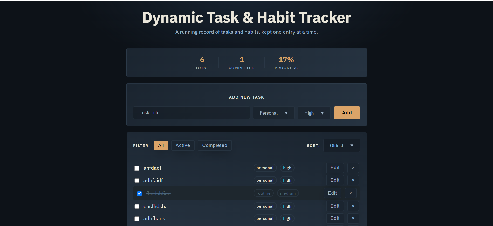

# Dynamic Task & Habit Tracker

A simple, responsive, browser-based task and habit tracker built with **HTML, CSS, and Vanilla JavaScript**.

The application allows users to create tasks, organize them by category and priority, mark them as completed, edit or delete them, filter and sort the task list, and track overall progress. All task data is stored locally in the browser using **LocalStorage**, so tasks remain available after refreshing the page.

---

## ✨ Features

* **Add Tasks**

  * Create a new task with a title.
  * Assign a category.
  * Assign a priority level.

* **Task Categories**

  * Personal
  * Study
  * Routine

* **Priority Levels**

  * High
  * Medium
  * Low

* **Complete Tasks**

  * Mark tasks as completed using a checkbox.
  * Completed tasks are visually distinguished with a strikethrough.

* **Edit Tasks**

  * Update an existing task's title, category, or priority.
  * Edit tasks through a dedicated popup interface.

* **Delete Tasks**

  * Remove tasks from the tracker instantly.

* **Task Filtering**

  * View all tasks.
  * View only active tasks.
  * View only completed tasks.

* **Task Sorting**

  * Oldest first.
  * Newest first.
  * High-to-low priority.

* **Progress Statistics**

  * Total number of tasks.
  * Number of completed tasks.
  * Overall completion percentage.

* **Persistent Data**

  * Tasks are saved in the browser's LocalStorage.
  * Data remains available after refreshing or reopening the page in the same browser.

* **Responsive Design**

  * Layout adapts to different screen sizes.
  * Includes mobile-specific responsive adjustments.

* **Keyboard & Interaction Support**

  * Press `Escape` to close the edit popup.
  * Clicking outside the popup also closes it.

---

## 🖥️ Preview



---

## 🛠️ Technologies Used

| Technology             | Purpose                                                                                  |
| ---------------------- | ---------------------------------------------------------------------------------------- |
| **HTML5**              | Application structure and semantic markup                                                |
| **CSS3**               | Styling, layout, responsive design, transitions, and visual effects                      |
| **Vanilla JavaScript** | Application logic, DOM manipulation, task management, filtering, sorting, and statistics |
| **LocalStorage API**   | Persistent client-side task storage                                                      |
| **Google Fonts**       | IBM Plex Sans typography                                                                 |

The application does not use a JavaScript framework or external UI library. The core functionality is implemented using Vanilla JavaScript.

---

## 📁 Project Structure

```text
Dynamic-Task-Habit-Tracker/
│
├── assets/
│   └── preview.png
│
├── index.html
├── styles.css
├── app.js
└── README.md
```

### `index.html`

Contains the main application structure, including:

* Application title and description
* Task statistics
* Task creation form
* Category and priority selectors
* Filter controls
* Sorting controls
* Dynamic task list
* Edit-task popup container
* JavaScript entry point

The application loads `styles.css` for styling and `app.js` for functionality.

### `styles.css`

Contains the complete visual design of the application, including:

* Dark-themed interface
* Responsive layout
* Form styling
* Task list styling
* Buttons and controls
* Completed-task states
* Popup styling
* Responsive breakpoints for tablets and mobile devices

The UI uses **IBM Plex Sans** and a dark blue/charcoal color scheme with warm accent elements.

### `app.js`

Contains the application's main functionality:

* Task creation
* Task editing
* Task deletion
* Completion handling
* Filtering
* Sorting
* LocalStorage persistence
* Statistics calculation
* Progress calculation
* Dynamic DOM rendering

Tasks are represented as JavaScript objects containing an ID, title, category, priority, completion state, and creation timestamp.

---

## 🚀 Getting Started

### Prerequisites

No build tools, package manager, or backend server are required.

You only need a modern web browser such as:

* Google Chrome
* Microsoft Edge
* Mozilla Firefox
* Safari

---

## 📥 Installation

### 1. Clone the repository

```bash
git clone https://github.com/your-username/dynamic-task-habit-tracker.git
```

### 2. Navigate to the project directory

```bash
cd dynamic-task-habit-tracker
```

### 3. Open the application

You can simply open:

```text
index.html
```

in your browser.

Alternatively, use VS Code's **Live Server** extension for a local development server.

---

## 🎯 How to Use

### Add a Task

1. Enter a task title.
2. Select a category:

   * Personal
   * Study
   * Routine
3. Select a priority:

   * High
   * Medium
   * Low
4. Click **Add**.

The task will immediately appear in the task list.

Empty task titles are ignored, and the input field receives focus when an empty submission is attempted.

---

### Complete a Task

Click the checkbox next to a task.

When a task is completed:

* Its completion state is updated.
* The task receives a completed visual state.
* Its title is displayed with a strikethrough.
* The progress statistics are updated.
* The new state is saved to LocalStorage.

---

### Edit a Task

Click the **Edit** button on any task.

The edit popup allows you to change:

* Task title
* Category
* Priority

Click **Save** to apply the changes.

You can also close the popup by:

* Clicking **Cancel**
* Pressing `Escape`
* Clicking outside the popup

---

### Delete a Task

Click the `×` button on a task to remove it.

The task is removed from the internal task array, LocalStorage is updated, and the task list is re-rendered.

---

## 🔎 Filtering

The application provides three filtering options:

| Filter        | Description               |
| ------------- | ------------------------- |
| **All**       | Displays every task       |
| **Active**    | Displays incomplete tasks |
| **Completed** | Displays completed tasks  |

The filtering system dynamically determines which tasks should be displayed before rendering the task list.

---

## ↕️ Sorting

Tasks can be sorted using three options:

### Oldest

Displays tasks according to their creation time, with the oldest tasks first.

### Newest

Displays the most recently created tasks first.

### Priority

Displays tasks from:

```text
High → Medium → Low
```

## The application internally assigns numeric rankings to the three priority levels to determine their order.

## 📊 Progress Tracking

The dashboard displays three statistics:

```text
Total      Completed      Progress
  10           6             60%
```

### Total

The total number of tasks currently stored.

### Completed

The number of tasks whose completion state is `true`.

### Progress

The completion percentage is calculated using:

```text
(completed tasks / total tasks) × 100
```

The result is rounded to the nearest whole number.

If there are no tasks, progress is displayed as `0%`.

---

## 💾 Data Persistence

This project uses the browser's **LocalStorage API** rather than a backend database.

Whenever task data changes, the application serializes the task array using `JSON.stringify()` and stores it under the `dataArray` key.

When the application loads, it attempts to retrieve the saved data using `JSON.parse()`.

### Task Data Structure

Each task follows this structure:

```javascript
{
    id: "unique-task-id",
    title: "Complete JavaScript project",
    category: "study",
    priority: "high",
    isComplete: false,
    createdAt: 1756300000000
}
```

### What this means

| Property     | Description                              |
| ------------ | ---------------------------------------- |
| `id`         | Unique identifier generated for the task |
| `title`      | Task name                                |
| `category`   | Task category                            |
| `priority`   | Task priority                            |
| `isComplete` | Completion status                        |
| `createdAt`  | Task creation timestamp                  |

Task IDs are generated using `crypto.randomUUID()`, while creation time is recorded using `Date.now()`.

---

## 🧠 Application Logic

The application follows a simple client-side data flow:

```text
User Action
     ↓
Event Listener
     ↓
Update Task Data
     ↓
Save to LocalStorage
     ↓
Render Task List
     ↓
Update Statistics
```

For example, when a user creates a task:

```text
Enter Task
     ↓
Submit Form
     ↓
Validate Input
     ↓
Create Task Object
     ↓
Add to dataArray
     ↓
Save to LocalStorage
     ↓
Render Tasks
```

The task list is generated dynamically from the current task data rather than being hard-coded into the HTML.

---

## 🎨 Design

The application uses a dark interface built around:

* Dark blue/charcoal backgrounds
* Warm amber accent color
* Rounded cards
* Minimal borders
* Compact controls
* IBM Plex Sans typography
* Responsive layouts

## The main application sections use gradient backgrounds and subtle borders to create visual separation between the dashboard, task form, and controls.

## 📱 Responsive Design

The application includes responsive CSS rules for smaller screen sizes.

At widths below `768px`, the main sections adjust their width and the controls become vertically oriented.

At widths below `480px`, the statistics section allows its contents to wrap and hides the desktop dividers.

---

## 🔄 Event Handling

The application relies heavily on JavaScript event listeners.

### Form Submission

The task creation form listens for the `submit` event and prevents the browser's default form submission behavior.

### Task Actions

The task list uses event delegation to handle:

* Delete
* Edit
* Complete/uncomplete

This allows dynamically rendered task elements to be handled through a single task-list event listener.

### Filtering

Filter buttons update the current filter state and trigger the task list to render again.

### Sorting

Changing the sorting dropdown updates the current sorting method and re-renders the task list.

---

## 🧩 Project Architecture

The project follows a straightforward three-layer frontend structure:

```text
HTML
│
├── Structure
├── Forms
├── Controls
└── Containers
       │
       ▼
JavaScript
│
├── State
├── Event Handling
├── Task Operations
├── Filtering
├── Sorting
├── Statistics
└── LocalStorage
       │
       ▼
CSS
│
├── Layout
├── Components
├── States
├── Animations
└── Responsive Design
```

There is no backend or server-side component.

---

## 🔐 Storage & Privacy

All task data is stored locally in the user's browser.

The project does not require:

* User accounts
* Authentication
* A backend server
* A database
* An external API

Because data is stored in LocalStorage, tasks are specific to the browser/device where they were created.

Clearing the browser's LocalStorage can remove the saved tasks.

---

## ⚠️ Current Limitations

This project is intentionally built as a frontend-only application, so there are some limitations.

### No Cloud Synchronization

Tasks are not synchronized between devices or browsers.

### No User Authentication

There is currently no login or account system.

### No Backend Database

All data exists only in browser LocalStorage.

### Limited Categories

The current application provides:

* Personal
* Study
* Routine

### Limited Sorting

The available sorting options are:

* Oldest
* Newest
* Priority from High to Low

### Habit Tracking Is Basic

Despite the project name, the current implementation primarily behaves as a task tracker. It does not yet implement dedicated habit-specific functionality such as:

* Daily habit streaks
* Weekly habit schedules
* Habit frequency
* Calendar-based tracking
* Streak statistics

These would be logical future extensions.

---

## 🚧 Future Improvements

Possible improvements include:

### Task Management

* [ ] Add due dates
* [ ] Add reminders
* [ ] Add recurring tasks
* [ ] Add task descriptions
* [ ] Add subtasks
* [ ] Add drag-and-drop task ordering
* [ ] Add confirmation before deleting a task

### Habit Tracking

* [ ] Create dedicated habits
* [ ] Track daily completion
* [ ] Implement habit streaks
* [ ] Add weekly/monthly habit views
* [ ] Add habit completion charts
* [ ] Track consistency percentage

### Filtering & Sorting

* [ ] Filter by category
* [ ] Filter by priority
* [ ] Sort by completion status
* [ ] Sort by due date
* [ ] Search tasks

### Data Management

* [ ] Export tasks as JSON
* [ ] Import tasks from JSON
* [ ] Add cloud synchronization
* [ ] Introduce a backend database
* [ ] Add user authentication

### UI/UX

* [ ] Add dark/light theme switching
* [ ] Improve mobile task layout
* [ ] Add animations for task creation/deletion
* [ ] Add empty-state messaging
* [ ] Add toast notifications
* [ ] Improve accessibility

---

## 📚 What I Learned

This project was built as a practical exercise in frontend development and provides hands-on experience with:

* DOM manipulation
* JavaScript event listeners
* Event delegation
* Arrays and objects
* Array methods such as `map()`, `filter()`, and `sort()`
* Conditional rendering
* Dynamic HTML generation
* LocalStorage
* JSON serialization/deserialization
* Form handling
* State management
* Responsive CSS
* CSS transitions
* Modal/popup interactions
* Basic application architecture

One of the important concepts demonstrated by the project is keeping the task data as the source of truth and regenerating the visible task list from that data whenever the state changes.

---

## 🧪 Running the Project Locally

Because this is a static frontend project, no installation or build process is required.

Simply clone the repository and open `index.html`.

For a better development experience, you can use VS Code with the **Live Server** extension.

Example:

```text
1. Clone repository
2. Open project in VS Code
3. Start Live Server
4. Open the application in your browser
5. Add and manage tasks
```

---

## 🤝 Contributing

Contributions are welcome.

If you want to improve the project:

1. Fork the repository.
2. Create a new branch.

```bash
git checkout -b feature/your-feature
```

3. Make your changes.
4. Test the application.
5. Commit your changes.

```bash
git add .
git commit -m "Add your feature"
```

6. Push your branch.

```bash
git push origin feature/your-feature
```

7. Open a Pull Request.

---

## 📄 License

This project is available for educational and personal use.

If you want to use, modify, or distribute this project, feel free to do so according to the terms you choose to establish for your repository.

---

## 👨‍💻 Author

**Sudharth**

Built with:

```text
HTML5
CSS3
Vanilla JavaScript
LocalStorage
```

---

## ⭐ If You Like the Project

If you found this project useful or interesting, consider giving the repository a ⭐ on GitHub.

It helps support the project and encourages further development.

---

## 📌 Project Status

**Status:** 🟢 Completed — Initial Version

The core task-management functionality is implemented, including task creation, editing, deletion, completion tracking, filtering, sorting, progress calculation, and LocalStorage persistence.

Future versions can expand the project from a basic task tracker into a more complete productivity and habit-management application.
